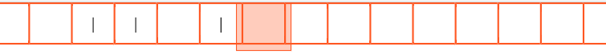
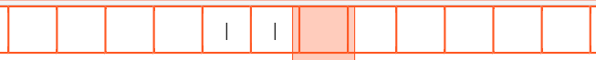
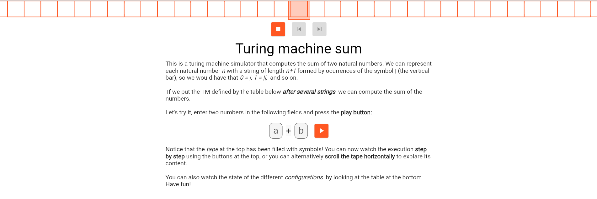
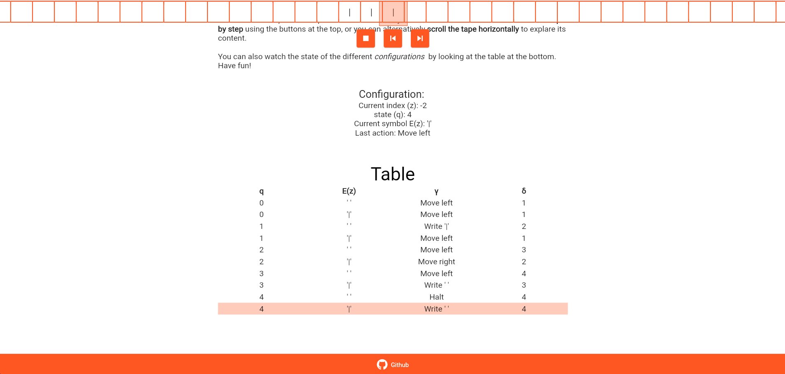
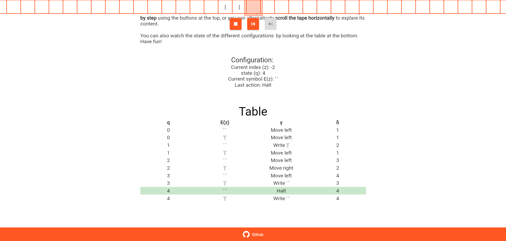

% Turing machines: A step by step simulation
% Carlos Javier Gutiérrez Sánchez
% February 26, 2021
\newpage
# Introduction
This project is an interactive webpage that simulates a Turing machine to compute the sum of two integers.
The webpage can be found [here](https://charly6596.github.io/turing_add/). I will start by introducing you to some of the Turing machine concepts.

# Introduction to Turing machines
A Turing machine (TM from now on) is an _ideal machine_ that **seems capable** of computing every function that
can be computed. It is nowhere close to a _real_ PC, however, it can be used as an accurate model for what any physical
computing device is capable of doing. 

## Components of a TM
The following picture is a graphical representation of a TM:


There is an **infinite tape** with a left and right direction, and is divided by cells. 
There are a finite number of cells that contain one **symbol** from a finite set of 
**symbols** that the TM understands, including the **empty symbol**. The infinite tape can be seen in the [webpage](https://charly6596.github.io/turing_add/) at the top of the screen.


The **finite-state control unit** can be in a certain **state** of a possible set of states and it can read or write one cell from the **tape** in a given moment. It also has an **instruction function** and a **transition function**, that given the current state
and symbol they return the instruction to execute and the next state to transit to. This can be easily understood by
visualizing the table in figure 2.


A TM can be represented with a table just like that one. In the order of columns, it has the current state,
the symbol read by the TM head, the instruction function, and the transition function. Every combination of current
state and symbol must be represented there.

As a side note, we can represent the TM with a transition diagram in a similar way DFA are represented.

## Configuration
We will use **configurations** to represent the current state of a TM. It's a tiple (q, E, z) where:

- **q** is the current state.
- **E** is the tape.
- **z** is the index of the head in the tape.

Thus _E(z) = current symbol_, which is, along with **q**, what the machine needs to execute the next instruction defined in the table.

## Basic operations
A TM can perform 4 basic operations, one at any given moment:

- Move the head to the left.
- Move the head to the right.
- Write a symbol on the current head position.
- Halt (ends).

We can compute every computable function with those operations.

# Computing a function
There are specific computational problems that a computer can't solve (_undecidable_ problems), 
problems that may be solvable or not (_partially solvable_ problems),
but I will, however, focus on a problem that can be solved, a problem that always has a computable solution,
problem that can be solved by applying a **recursive function**. 

We will use an interactive [webpage](https://charly6596.github.io/turing_add/) to understand how the machine computes the sum function, that given
two natural numbers it returns the sum of them, _sum(a, b) = a + b_. We need to find a way to represent
numbers in a TM. That can be easily done if given a number n we use a string formed by repetitions of the symbol _|_ of length n+1,
so that 0 = |, 1 = ||, 5 = ||||||... and so on. Now we just need a way to write the input
variables into the tape and to know when is the solution computed.

## Input values
We can apply the concept of putting a TM _after severals strings_, which means that there is a tape with a sequence of strings with
one character per cell separated by the empty symbol and we put the head of the machine at the right of the last string of the
sequence. That is represented in the [webpage](https://charly6596.github.io/turing_add/) after writing two numbers and pressing the play button:



What we are doing here is using the integers 1 and 0 as input to our function.

## The solution
A solution is computed when the machine _halts after a string_. As I mentioned before, _after a string_ means that the head is at the right
of a sequence of symbols and the current symbol is the empty symbol.
This is the solution of _sum(1, 0)_:




The machine did halt after the string "||" and the current symbol is the empty string. The solution is 1.

After presenting the different concepts that I used to develop the [webpage](https://charly6596.github.io/turing_add/) I will proceed with the idea and implementation.

# Implementation
The [webpage](https://charly6596.github.io/turing_add/) has been developed using [Flutter web](https://flutter.dev/web), which is still in beta, however, the implementation of the Turing machine and the data structure that represents the tape was done purely with [Dart](https://dart.dev/). The concepts and ideas should be valid for any object-oriented programming language with minor variations. Let's begin with the infinite tape.

## The tape
The chosen data structure is a list with a zipper. I've found out about zippers after a bit of research and it fits perfectly
the concept of a machine that can read a single cell at a time. It consists of two arrays, the left and the right side, 
and the idea behind that is that you focus on a single position and you can only read and write on that position.
I wanted my implementation to feel like a TM tape, so I've called the main methods `read()`, `moveLeft()`, `moveRight()` and
`write()`, just like the possible operations a TM can perform excluding halt.
Here's the implementation:

```dart
  String read() => _right.first;

  void write(String s) {
    _right.removeFirst();
    _right.addFirst(s);
  }
  
  void moveRight() {
    var elem = _right.removeFirst();
    _left.addLast(elem);
    if (_right.isEmpty) {
      _right.add(blank);
    }
  }

  void moveLeft() {
    var elem = _left.isEmpty ? blank : _left.removeLast();
    _right.addFirst(elem);
  }
```

The first element of the `right` queue is the head position. To move to the left or the right I shift the elements
one position to the left or the right respectively. Since the tape is infinite, if we move to a position that has not yet been explored it will place an empty symbol on the head position.

The `tape` data structure also contains other methods just to display its contents conveniently while making the [webpage](https://charly6596.github.io/turing_add/).

Let's see a usage example with the corresponding internal values:

```dart
Tape t = Tape(left: [], right: [], blank: "*"); // t = [[] * []]
t.write("1"); // t = [[] 1 []]
t.moveRight(); // t = [[1] * []]
t.write("1"); // t = [[1] 1 []]
t.moveRight(); // t = [[1, 1] * []]
t.moveRight(); // t = [[1, 1, *] * []]
```

## The machine
The logic of the actual **finite-state control** is in the abstract class `Machine`. That class contains the core functionality
of a TM and the necessary properties to work with. It contains the `table`, a list of `states`, the `alphabet` and the `blankSymbol`, and it's up to the implementer to decide how to initialize the value of those properties. 
For example, in the case of this [webpage](https://charly6596.github.io/turing_add/) I've _hardcoded_ the values. We will see in the last section a different approach.
Let's take a look at the method that computes the next state and performs the **instructions** defined in the `table`:

```dart
  Configuration transitNext(Configuration c) {
    if (c.isTerminal) {
      return c;
    }

    var ss = c.stateSymbol;

    var instruction = getInstruction(ss);
    var nextState = getTransition(ss);
    Tape tape = c.tape.copyWith();
    int index = c.index;

    if (instruction is Write) {
      tape.write(instruction.symbol);
    } else if (instruction is MoveLeft) {
      index--;
      tape.moveLeft();
    } else if (instruction is MoveRight) {
      index++;
      tape.moveRight();
    }

    return Configuration(
      state: nextState,
      index: index,
      tape: tape,
      instruction: instruction,
    );
  }
}
```

Given a `Configuration`, executes the next `Instruction` and return a new `Configuration`. If the given `Configuration` is
terminal (the machine is halted), then returns it. The tape is cloned to a new instance to avoid mutating data that might be
in use. The `Machine` also has two methods that can't be overrided that are equivalent to the **transition** and **instruction** functions. 

```dart
  @nonVirtual
  Instruction getInstruction(StateSymbol ss) => table[ss].instruction;

  @nonVirtual
  int getTransition(StateSymbol ss) => table[ss].nextState;
```
`StateSymbol` is a simple structure containing a pair (symbol, state) and is the key of the `table`.

Another important feature of the `Machine` class is the validation method `checkTable()`. It throws an error when the table is not valid. Let _||K||_ be the number of states and _n_ the number of symbols of the alphabet, a table is valid when:

- $||K||\times(n + 1) =$ _number of rows of the table_.
- Every (symbol, state) pair has a row in the table.
- Each state appears | alphabet | + 1 times in the table.

It is highly recommended for the implementer to call the `checkTable()` method every time the table is updated.

This class however doesn't handle itself the functionality of going back implemented in the webpage and neither keeps track of the current
state. 

## The sum machine
`SumMachine` implements the `Machine` class with some extra features. The most notable feature is keeping track of the computed configurations. That provides us with the ability to go back and forward without computing that again. It has a method `initialize(a, b)` to start the machine with the given input, converting the input to their respective strings using the alphabet symbols and put the machine after those strings. Since we keep track of the current state, we can create a method to advance to the next configuration based on the current one, checking first if it was already computed: 

```dart
Configuration next() {
    _ensureInitialized();
    
    if (_index + 1 < _history.length) {
      return _history[++_index];
    }

    return transitNext(_history[_index]);
  }
```

The method `transitNext` has been overriden in  order to update the current index and add the computed configuration to the history:

```dart
  @override
  Configuration transitNext(Configuration c) {
    _ensureInitialized();
    var config = super.transitNext(c);
    _history.add(config);
    _index++;
    return config;
  }
```
# Improvements
The library developed still has room for improvement. A good improvement for the webpage and the library itself would be
making and implementation of the `Machine` class in a more generic way, one that allows passing the `table` and the `alphabet` as a parameter. This could let the user introduce any table instead of using a predefined one. 
Other improvements:
- Developing a language to program the machine 
- Convert the machine to a diagram to visualize the states in a graphic way
- Keybinds in the webpage
- The possibility to create and save machines

# References and screenshots
- Zippers: http://learnyouahaskell.com/zippers, https://stackoverflow.com/a/380498
- Introduction to Automata Theory, Languages and Computation. John E. Hopcroft, Jeffrey D. Ullman and Rajeev Motwani.
- Flutter web: https://flutter.dev/web
- Dart: https://dart.dev/
- Project repository: https://github.com/Charly6596/turing_add/
- Project webpage: https://charly6596.github.io/turing_add/







